# The Red Crayon
The Red Crayon is a news & social media platform for Artists & Art-lovers alike. Here, users can find the latest articles relating to the art world, along with up & coming events in their local cities. We also invite users to interact with each other by sharing posts that inform others what they are working on, and what inspirational tools they are working with.

- The repository for the DRF-API associated with this project is available [HERE](https://github.com/CluelessBiker/project5-drf-api). The installation, set up, and deployment steps for this section of the project have also been included in the README linked to the DRF-API. 

#### DEPLOYED API HEROKU [LINK](https://project5-drf-api.herokuapp.com)
#### DEPLOYED FRONTEND HEROKU [LINK - LIVE SITE](https://red-crayon.herokuapp.com/)
#### DEPLOYED BACKEND GITHUB [REPOSITORY](https://github.com/CluelessBiker/project5-drf-api)

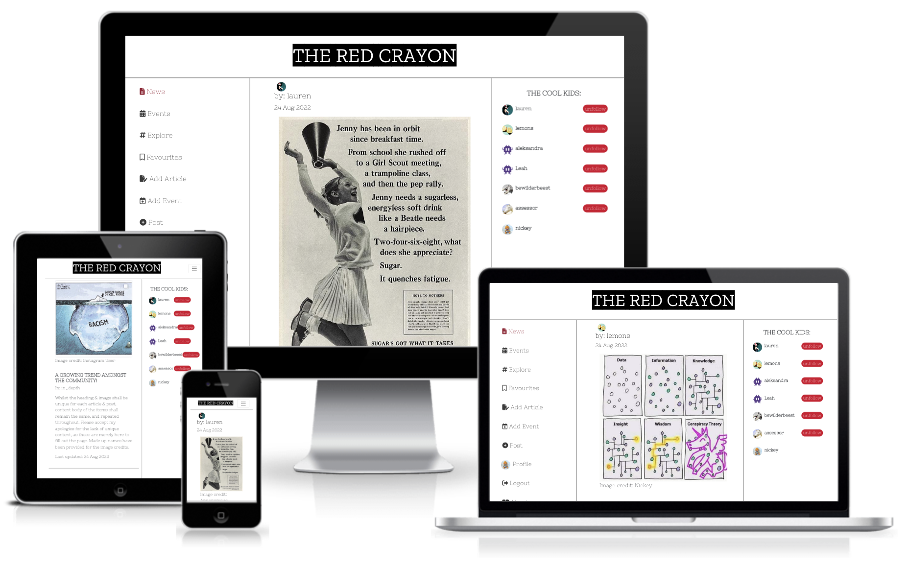

The live link for "The Red Crayon" can be found [HERE](https://red-crayon.herokuapp.com/)

## Table of Contents
+ [UX](#ux "UX")
  + [Site Purpose](#site-purpose "Site Purpose")
  + [Site Goal](#site-goal "Site Goal")
  + [Audience](#audience "Audience")
  + [Communication](#communication "Communication")
  + [Current User Goals](#current-user-goals "Current User Goals")
  + [New User Goals](#new-user-goals "New User Goals")
+ [User Stories](#user-stories "User Stories")
  + [Admin stories](#admin-stories "Admin stories")
  + [Artist stories](#artist-stories "Artist stories")
  + [Visitor stories](#visitor-stories "Visitor stories")
+ [Design](#design "Design")
  + [Colour Scheme](#colour-scheme "Colour Scheme")
  + [Typography](#typography "Typography")
  + [Imagery](#imagery "Imagery")
+ [Features](#features "Features")
  + [Existing Features](#existing-features "Existing Features")
  + [C.R.U.D](#crud "C.R.U.D")
+ [Testing](#testing "Testing")
  + [Validator Testing](#validator-testing "Validator Testing")
  + [Unfixed Bugs](#unfixed-bugs "Unfixed Bugs")
+ [Technologies Used](#technologies-used "Technologies Used")
  + [Main Languages Used](#main-languages-used "Main Languages Used")
  + [Frameworks, Libraries & Programs Used](#frameworks-libraries-programs-used "Frameworks, Libraries & Programs Used")
+ [Components](#oomponents "Components")
+ [Deployment](#deployment "Deployment")
+ [Credits](#credits "Credits")
  + [Content](#content "Content")
  + [Media](#media "Media")

## UX

### Site Purpose:
To bring interactivity to the art community by sharing the latest news, events, and feedback from other artists & users.

### Site Goal:
The Red Crayon is intended to keep the community informed about the ongoings in the art-world, and to share inspiration & events with each other, as well as bring people together.

### Audience:
Everyone with an interest in Art, and the desire to reach out & connect with like-minded individuals.

### Communication:
The layout is intended to represent a news tabloid, whilst at the same time having a playful, interactive feel to it. With the navigation panel being present at all times, the users can quickly navigate through the site to arrive at their intended destination.

### Current User Goals:
To keep users coming back again & again to see what is new in terms of news & events, as well as to follow up with other users that they follow.

### New User Goals:
To engage the user in a meaningful way, and encourage them to explore everything that the site has to offer.

### Future Goals:
- To provide different types of user accounts, so that access is restricted for who may publish specific types of content, such as news articles & events.
- Provide the ability for users to send private messages to either another user, or a group of users.
- To expand the events section & provide a google maps location for each event, so that users may understand in more detail where an even is to be hosted.

## User Stories
I have included links to the [GitHub Issues](https://github.com/CluelessBiker/project5-red-crayon/issues) for this project, as well as the [KANBAN board](https://github.com/users/CluelessBiker/projects/2).

Please also find a full list of the Epics, User stories, & story points typed up [HERE](src/assets/userstories.md).

## Design

### Wireframes:

##### Home Page - Desktop: 

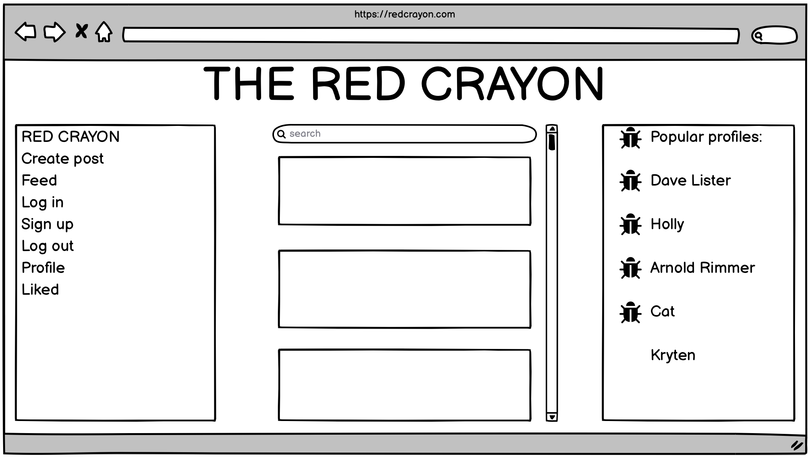

##### Home Page - Mobile: 

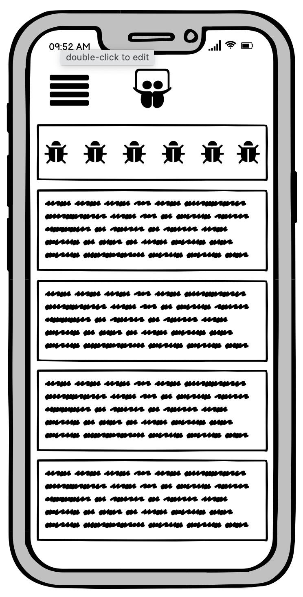

##### Form Page:


##### Site Navigation:

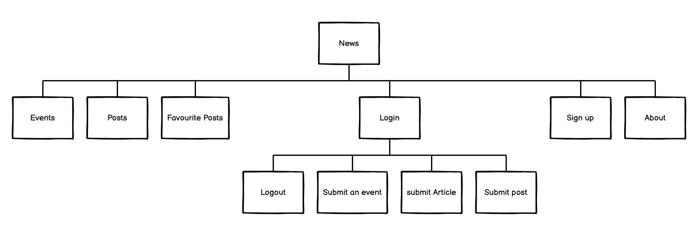

### Database Schema:
This has been uploaded to the Backend README, which can be found [HERE](https://github.com/CluelessBiker/project5-drf-api).

### Colour Scheme:

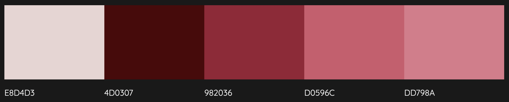

### Typography:
All fonts were obtained from the Google Fonts library. I chose the following fonts for the page:
1. Zilla Slab Highlight : Site header
2. Nixie One : Site content

## Features

### Existing Features:

#### Header:


##### Navigation - Desktop:

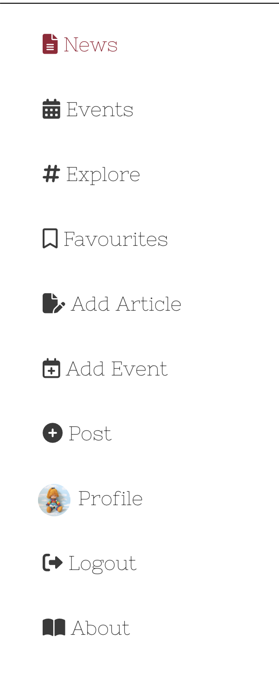

##### Navigation - Mobile:

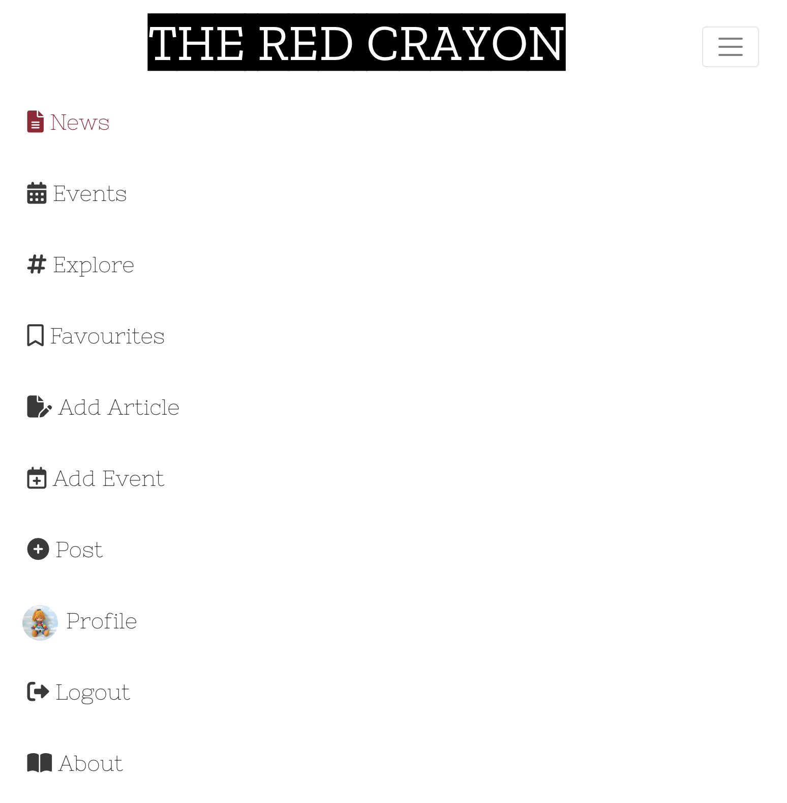

#### About Page:

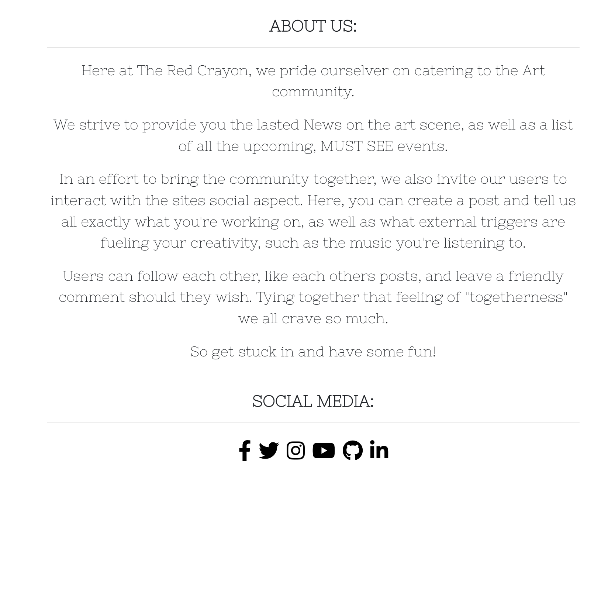

#### Articles Page:

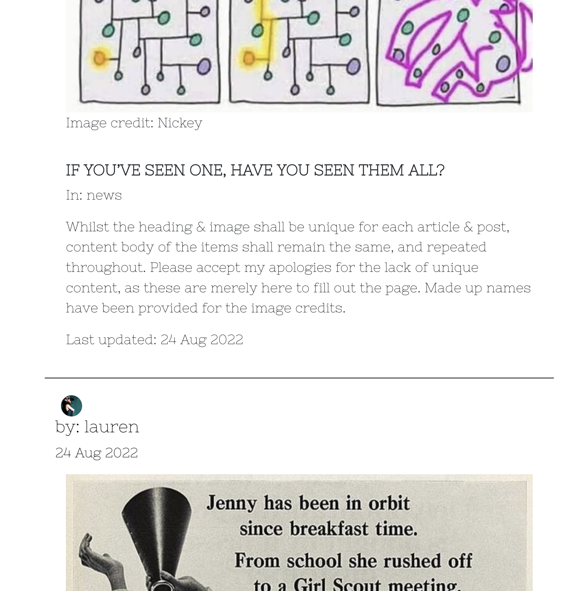

#### Submission Form:

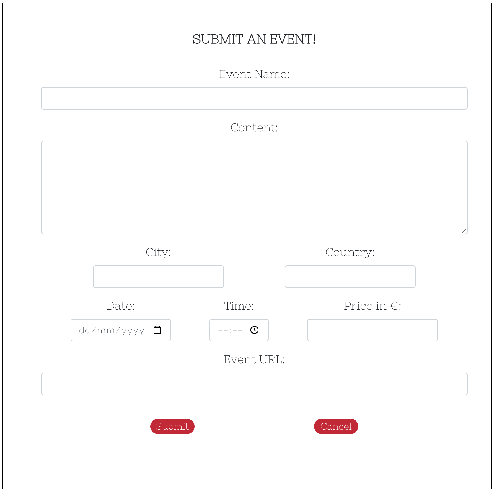

#### 404 Page Not Found:

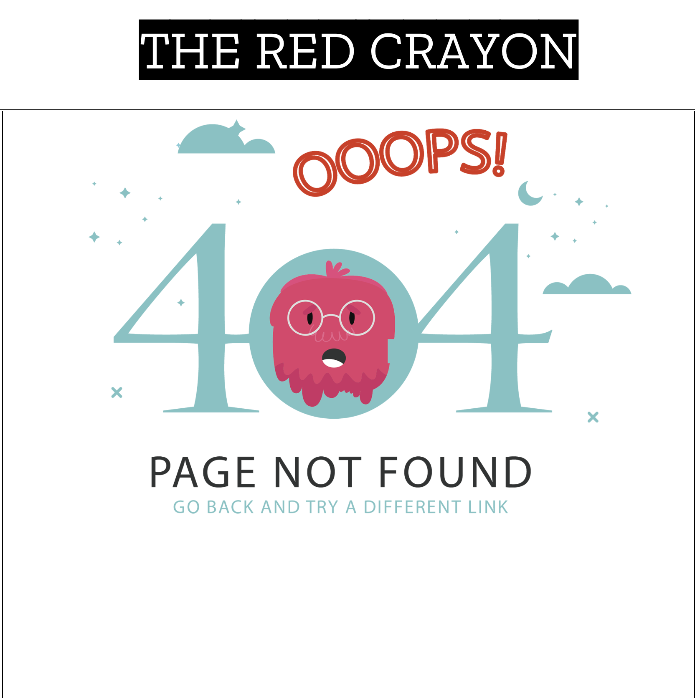

#### Popular Profiles:

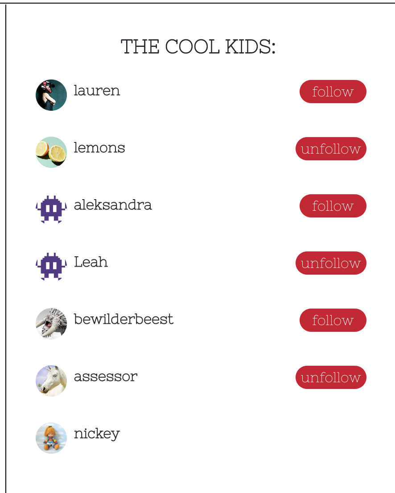

#### Social Links:

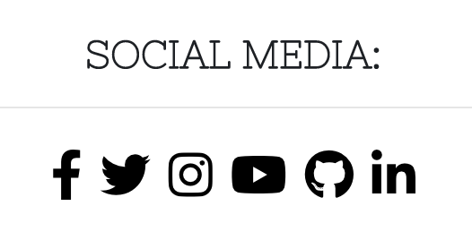

#### Log in, Log out & Sign up:

##### Login:

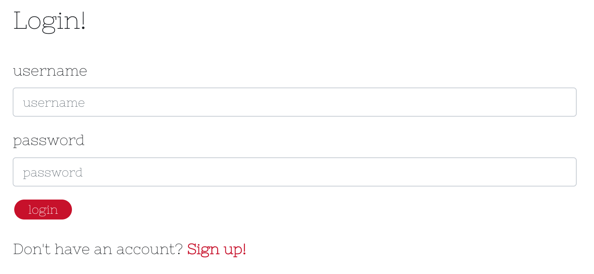

##### Logout:


##### Sign-up:

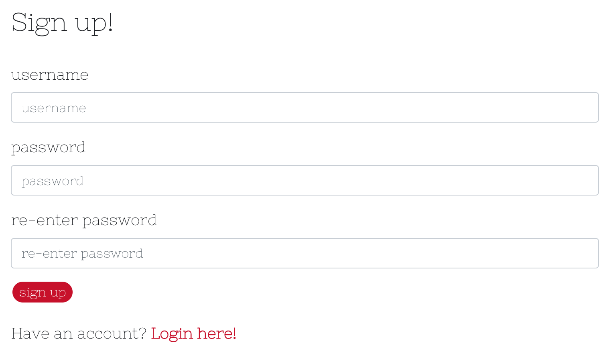

### Features Left to Implement:
- The ability to like articles & events.
- The ability to leave comments on articles & events
- Notifications when a user receives a new follower, comment, or like.
- Email notification when a new Article has been published to the site.
- Private messaging between users.
- Group messaging between users.
- Restrict profile & posts views to only an approved list of users, should a user wish.
- A contact form so that users can provide feedback.

## Testing

### Manual Testing:
1. SignUpForm gives 400 error:
 - Resolved by changing `password` to `password1` in form fields & variable keys.
2. 500 server error:
 - Resolved with the aid of tutor support. All database migrations for both the Django project & apps needed to be cleared & remigrated. The precise steps for this have been documented in the README for the deployed backend API.
3. CRUD functionality has been tested for each of the following: Posts | Articles | Events | Comments | Likes | Follow | Profile
 - Likes & Follow may only be created & deleted
 - Profile may only be updated
4. All nav links open to the correct page.
5. All external links open to a new browser window.
6. Pages intended for logged-in users only will redirect logged-out users back to the home page.
7. Users attempting to edit content that they did not publish are redirected back to the home page.
8. Users are able to create a new account.
9. Users with an existing account are able to log in.
10. Each user has the ability to log out.

### Validator Testing
1. CSS files pass through the [Jigsaw validator](https://jigsaw.w3.org/css-validator/) with no issues found.


2. a. Javascript files pass through [ESLint](https://eslint.org/). The following issues were raised, and have been intentionally ignored as they are in relation to code that was provided in the Moments Walkthrough project:
 - Props spreading is forbidden
 - Do not pass children as props. 
 - Do not use Array index in keys
 - 'a_name' is already declared in the upper scope
 - Expected an assignment or function call and instead saw an expression
 - Do not nest ternary expressions
 - Fragments should contain more than one child
2. b. Additionally, this error has also been ignored:
 - Identifier 'field_name' is not in camel case 
 - - relates to a database field in the API, case cannot be changed for this reason.
2. c. All instances of errors where a newline has been asked for within an opening & closing set of tags, eg:
 - `<p>{owner} doesn't like the {drink}</p>` should be written as:
```
<p>
  {owner}
  {' '}
  doesn't like this
  {' '}
  {drink}
</p>
```
 - This particular rule does not lend to the readability of the code, & instead hinders it (in my opinion).
2. d. All `console.log(err);` have been left in place & commented out, as it was suggested that this is also done in real-world scenarios.
2. e. Added all files affected by the above, unresolved warnings to `.eslintignore`, as well as added the following line to the top of each individual file, `/* eslint-disable */` to allow for a successful deployment on Heroku.

3. The page has an excellent Accessibility rating in Lighthouse:

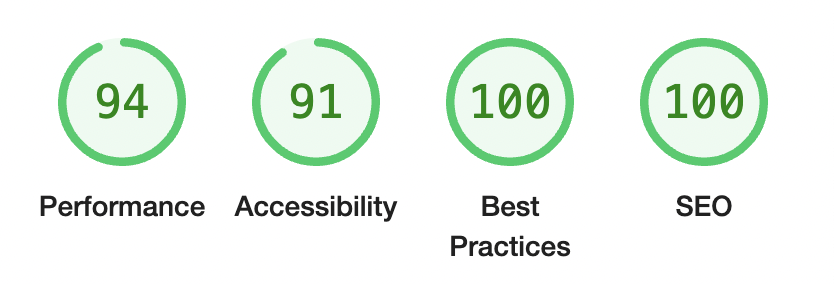

4. Tested the site opens in Brave, Chrome, Safari & on a mobile device without issues.

5. All social links open to external pages as intended.

### Unfixed Bugs
Whilst it is not technically a bug, I would like to add that I am not entirely satisfied with the header of the site on mobile devices. Increasing the font size to make it stand out, causes the burger icon to shift onto a new line, which takes up too much real estate on the screen. I had attempted early on to separate out the components & have them be independent of each-other, however this then presented a new issue. When shrinking the size of the burger icon, this also shrank the expanding window, which cut off the navigation items. I was unable to ascertain how to target the exact style rule imposed by React-Bootstrap to over ride this and expand the display window, and instead compromised by implementing a smaller font-size into my heading.

## Technologies Used
### Main Languages Used
- HTML5
- CSS3
- Javascript
- Python
- SQL - Postgres

### Frameworks, Libraries & Programs Used
- Google Fonts : For the site fonts.
- Font Awesome : To add icons to the social links in the footer & navigation sections.
- GitPod : To build the project & create the JSX & CSS files before pushing the project to Github.
- GitHub : To store my repository for submission.
- Balsamiq : Was used to create mockups of the project prior to starting.
- Am I Responsive? : To ensure the project looked good across all devices.
- Favicon : To provide the code & image for the icon in the tab bar.
- Django : Used to build the backend database that serves as an API for the front-end project.
- React-Bootstrap : The styling library that has aided to the layout of the site, and which was introduced to us during the course of the program.
- DrawSQL : An interactive tool that allows for the creation of Database mock-ups so that we can visualise the relationships between models.
- ReactJS : To build the components that would collectively form the front-end application.

## Components
Several components have been implemented within this project that have been reused throughout the project:
1. axiosDefault.js : for ease of communication with the backend API.
2. Asset.js : to supply the loading spinner & user avatar throughout the site.
3. DropdownMenu.js : to allow users to edit/delete their Articles, Events & Posts.
4. CurrentUserContext.js : confirm users logged-in status to determine what functionality is available to that user.
5. ProfileDataContext.js : provide un/follow ability to other users across PopProf & ProfPage components.
6. ToggleCollapse.js : whilst this component has only been applied to the NavBarMini, it could in theory be applied to additional dropdown menus installed into the site in the future to allow for the automatic collapse of an element upon mouse click.
7. useRedirect.js : redirects a user to another page if they are not authorised to be on the page they are trying to access.
8. utils.js : supplies functionality to all of the components that utilise the Infinite Scroll.

## Deployment
The site was deployed to Heroku. The steps to deploy are as follows:
1. Launch the gitpod workspace.
2. Install ReactJS:
```
npx create-react-app . --use-npm
npm start
```
2. Install the following packages using the command `npm install`:
```
react-bootstrap@1.6.3 bootstrap@4.6.0
react-router-dom@5.3.0
axios
react-infinite-scroll-component
msw --save-dev
jwt-decode
-g eslint
```
3. Git add, commit, and push changes to gitpod.
4. Create the project app on Heroku, and link the GitHub repository by navigating to the 'Deploy' tab.

### Connecting to the API:
1. Navigated to the Heroku app of the project DRF-API, and under the Settings tab, added the following configvars:
- Key: CLIENT_ORIGIN | Value: https://react-app-name.herokuapp.com
- Key: CLIENT_ORIGIN_DEV | Value: https://gitpod-browser-link.ws-eu54.gitpod.io
2. Check that the trailing slash `\` at the end of both links has been removed, and save the configvar pairs.
3. Install the Axios package, & create supporting `axiosDefaults.js` as shown in [Moments Walkthrough](https://github.com/Code-Institute-Solutions/moments/blob/cf955d2f2e6f70f61c92d1f9de85558d8e49f3a8/src/api/axiosDefaults.js).

### Deploy to Heroku:
1. In the `scripts` section of `package.json` in gitpod, added the following command:
```
"heroku-prebuild": "npm install -g serve",
```
2. Add Procfile to project root & populate with the following:
```
web: serve -s build
```
3. Repeat the steps of git add/commit/push.
4. Deploy the project via the deploy button on Heroku.

## Credits

### Content
- Code Institute: The creation of the project came to life by utilising the Moments walkthrough step-by-step as a base foundation, and then building upon it to make the project my own. This is evident from the numerous docstrings within my files crediting the walkthrough.
- [Mats Simonsson](https://github.com/Pelikantapeten): A fellow student & friend who consistently helps me to troubleshoot when needed, supports me constantly, and is my rubber duck.
- [Martina Terlevic](https://github.com/SephTheOverwitch): A constant support system, providing reassurance, and the ability to calm me down.
- [BobbyHadz](https://bobbyhadz.com/blog/react-you-are-importing-createroot-from-react-dom#:~:text=The%20error%20%22You%20are%20importing,js%20.): provided the answer on how to resolve a console error indicating that the createRoot render was not compatible with the current version of ReactJS.
- Two events have been added to the site. The content for these was taken from the [Stavros Niarchos Foundation](https://www.snfcc.org/en/events), and the [Meet Market](https://www.themeetmarket.gr/en/). Each event has also been credited within the content body.

### Media
- 404 Error Graphic from [PNG Tree](https://pngtree.com/freepng/404-error-interface-art-word-design_4043816.html)
- Images for the Articles, Events & Posts made on the site have been accumulated from numerous sources on Twitter & Instagram. I do not have the information of the original content creator for these memes.